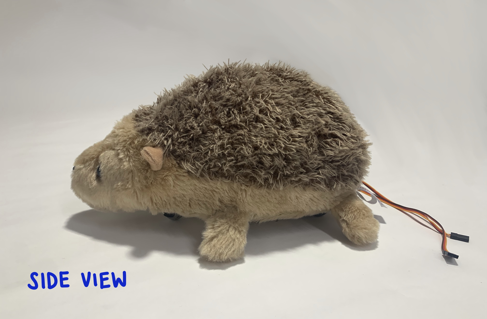

# Hedgehog Preservation Game
A game developed to educate general audience - and kids in particular - to the dangers hedgehogs are facing, and the importance of trying to preserve them. A detailed description of the game experience can be found in a document in this repository.

 
 

 

## Hardware 
This game is designed to be run on a Seeed WIO terminal and the following hardware is required:
* 1x - Seeed WIO terminal 
* 1x - WIO battery
* 2x - Continuous rotation servos (Either with grove port or grove adapter)
* 1x - Grove Multichannel V2 gas sensor
* 1x - Hedgehog stuffed toy
* 1x - Laser cut shell. Can be found in this repository

## Code Setup
* To run this code you must be running the latest WIO wifi firmware and download the associated libraries. The instructions for this update can be found here https://wiki.seeedstudio.com/Wio-Terminal-Network-Overview/
* The SAMD_ISR_Servo Library must be downloaded from here https://github.com/khoih-prog/SAMD_ISR_Servo. The patch mentioned in the readme file for the WIO terminal needs to be applied.
* Once the prerequisites are met, The Botv1.ino file can be opened in an Arduino IDE and uploaded to the board.

### This README is a work in progress ###
